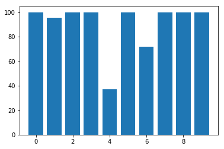

*This was a pretty failed attempt.  I got decent results, but for pretty aweful reasons that I should have seen at the very beginning*

The following code comes from a Jupyter notebook.  Next project is to figure out a way to import that notebook directly into this website.


```python
import pandas as pd
import numpy as np
import re
from sklearn.model_selection import train_test_split
from sklearn.ensemble import RandomForestClassifier
from sklearn.neighbors import KNeighborsClassifier
from sklearn.naive_bayes import GaussianNB
from sklearn.linear_model import Perceptron
from sklearn.linear_model import SGDClassifier
from sklearn.tree import DecisionTreeClassifier
from sklearn.model_selection import cross_val_score

data = pd.read_csv('final_data.csv')

target = data['Complaint Type']
train = data.drop(['Complaint Type'], axis=1)


X_train, X_test, y_train, y_test = train_test_split(train, target, test_size=0.15, random_state=42)

knn = KNeighborsClassifier(n_neighbors = 3)
gaussian = GaussianNB()
perceptron = Perceptron()
sgd = SGDClassifier()
decision_tree = DecisionTreeClassifier()
random_forest = RandomForestClassifier(n_estimators=100)

classifiers = [knn, gaussian,perceptron, sgd, decision_tree, random_forest]

```


```python
for clf in classifiers:
    print clf
    print cross_val_score(clf, train, target, cv=3)

```

    KNeighborsClassifier(algorithm='auto', leaf_size=30, metric='minkowski',
               metric_params=None, n_jobs=1, n_neighbors=3, p=2,
               weights='uniform')
    [ 0.5372409   0.37742245  0.45350896]
    GaussianNB(priors=None)
    [ 0.58016618  0.59173817  0.59281707]
    Perceptron(alpha=0.0001, class_weight=None, eta0=1.0, fit_intercept=True,
          max_iter=None, n_iter=None, n_jobs=1, penalty=None, random_state=0,
          shuffle=True, tol=None, verbose=0, warm_start=False)
    [ 0.47385788  0.54337913  0.54343065]
    SGDClassifier(alpha=0.0001, average=False, class_weight=None, epsilon=0.1,
           eta0=0.0, fit_intercept=True, l1_ratio=0.15,
           learning_rate='optimal', loss='hinge', max_iter=None, n_iter=None,
           n_jobs=1, penalty='l2', power_t=0.5, random_state=None,
           shuffle=True, tol=None, verbose=0, warm_start=False)
    [ 0.19248883  0.17390652  0.13291728]
    DecisionTreeClassifier(class_weight=None, criterion='gini', max_depth=None,
                max_features=None, max_leaf_nodes=None,
                min_impurity_decrease=0.0, min_impurity_split=None,
                min_samples_leaf=1, min_samples_split=2,
                min_weight_fraction_leaf=0.0, presort=False, random_state=None,
                splitter='best')
    [ 0.92074872  0.92695146  0.9323112 ]
    RandomForestClassifier(bootstrap=True, class_weight=None, criterion='gini',
                max_depth=None, max_features='auto', max_leaf_nodes=None,
                min_impurity_decrease=0.0, min_impurity_split=None,
                min_samples_leaf=1, min_samples_split=2,
                min_weight_fraction_leaf=0.0, n_estimators=100, n_jobs=1,
                oob_score=False, random_state=None, verbose=0,
                warm_start=False)
    [ 0.93937667  0.94279114  0.94503285]


Lets just look at Decision Tree's and Random Forest Classifiers. 
This is most certainly not a good idea - we're not really understanding what's happening with the data.
Throwing a million classifiers at something and just seeing what works is a good way to get garbage results.  It's also not a good way to learn much.

But for today, it's gonna give me a starting place.


```python

decision_tree.fit(X_train, y_train)
```
    DecisionTreeClassifier(class_weight=None, criterion='gini', max_depth=None,
                max_features=None, max_leaf_nodes=None,
                min_impurity_decrease=0.0, min_impurity_split=None,
                min_samples_leaf=1, min_samples_split=2,
                min_weight_fraction_leaf=0.0, presort=False, random_state=None,
                splitter='best')


```python
random_forest.fit(X_train, y_train)

```


    RandomForestClassifier(bootstrap=True, class_weight=None, criterion='gini',
                max_depth=None, max_features='auto', max_leaf_nodes=None,
                min_impurity_decrease=0.0, min_impurity_split=None,
                min_samples_leaf=1, min_samples_split=2,
                min_weight_fraction_leaf=0.0, n_estimators=100, n_jobs=1,
                oob_score=False, random_state=None, verbose=0,
                warm_start=False)


Decision tree's tend to overfit data with lots of samples.  I'm gong to build one of these from scratch and put a blog post about it soon.

Our data has quite a few attributes - so lets get the accuracy, but then look at what it's classifying well, and what it's classifying poorly.


```python
decision_tree.feature_importances_


```


    array([  1.66800875e-02,   1.67718420e-02,   3.45429289e-02,
             2.40193953e-05,   4.81334414e-04,   6.45261706e-04,
             1.05405184e-03,   7.71337847e-04,   1.41951344e-03,
             1.11196784e-03,   1.16202098e-03,   1.03529218e-03,
             9.47391590e-04,   1.28060424e-03,   7.94292139e-04,
             7.79050275e-04,   5.95337870e-05,   1.79610766e-04,
             3.41269272e-04,   6.84720679e-04,   3.75702131e-04,
             1.12912256e-03,   2.06782161e-03,   1.29999427e-03,
             1.90978771e-03,   1.27415751e-03,   1.40284779e-03,
             1.76682159e-03,   1.62450121e-03,   0.00000000e+00,
             0.00000000e+00,   0.00000000e+00,   0.00000000e+00,
             1.31430909e-02,   0.00000000e+00,   5.48154975e-04,
             9.48273065e-04,   9.16910910e-04,   9.07941717e-04,
             5.91853798e-04,   2.83111988e-04,   1.31171782e-04,
             0.00000000e+00,   0.00000000e+00,   2.22097768e-04,
             0.00000000e+00,   7.41918447e-05,   1.95832114e-04,
             1.05516346e-04,   8.86846589e-04,   9.37546315e-04,
             3.79015891e-04,   1.99641727e-05,   0.00000000e+00,
             .......])


This gives us a weighting of relative importances scalled to a total of 1.


```python
decision_tree.score(X_test, y_test)

```

    0.92893333333333339


This gives us an accuracy, but we still don't know what we're getting wrong.  And considering this is pretty skewed data (some classes have very few poitnts), we're gonna need to see how were doing across the board.  92% acacuracy doesn't mean much if 92% of the data falls into one catagory!


```python

y_test = y_test.reset_index(drop=True)

prediction = decision_tree.predict(X_test)

def correct_percentage(predicted, test_set):
    dictionary = {}
    percentages = {}
    for i in range(0, len(test_set)):
        if test_set[i] not in dictionary:
            dictionary[test_set[i]] = [0,0]
        if predicted[i] == test_set[i]:
            dictionary[test_set[i]][0] += 1
        else:
            dictionary[test_set[i]][1] += 1
    for i in dictionary.keys():
        temp = sum(dictionary[i])
        percentages[i] = dictionary[i][0]/float(temp)*100
    return dictionary, percentages

RS, CP = correct_percentage(prediction, y_test)
print RS, CP
```

go over test and training data to see if we're over fitting.


    {'Noise': [2176, 0], 'Noise - House of Worship': [44, 2], 'Noise - Residential': [8172, 10], 'Noise - Helicopter': [50, 0], 'Noise - Vehicle': [287, 486], 'Collection Truck Noise': [11, 0], 'Noise - Street/Sidewalk': [1381, 546], 'Noise - Commercial': [1598, 1], 'Noise - Park': [171, 0], 'Noise Survey': [65, 0]} {'Noise': 100.0, 'Noise - House of Worship': 95.65217391304348, 'Noise - Residential': 99.8777804937668, 'Noise - Helicopter': 100.0, 'Noise - Vehicle': 37.128072445019406, 'Collection Truck Noise': 100.0, 'Noise - Street/Sidewalk': 71.66580176440063, 'Noise - Park': 100.0, 'Noise - Commercial': 99.93746091307067, 'Noise Survey': 100.0}


So, looking at this data, we did pretty well on most topics, and absoutly aweful on Vehicle Noise and poorly on Stree/Sidewalk noise.

Lets just plot it to see

```python

import matplotlib.pyplot as plt

plt.bar(xrange(len(CP.keys())),CP.values())
```


    <Container object of 10 artists>





It's not a huge wonder that we didn't do well with Vehicle data.  A Vehicle could really be anywhere in the city.
Same with Street and Sidewalk

Maybe there is some other data that we removed that we could work with to help this out.

In the meantime, the SciKit Learn documentation has a lot of tips on practical use of decision trees.  Lets start workign through that


```python
decision_tree2 = DecisionTreeClassifier(min_weight_fraction_leaf = .01)

decision_tree2.fit(X_train, y_train)
```


    DecisionTreeClassifier(class_weight=None, criterion='gini', max_depth=None,
                max_features=None, max_leaf_nodes=None,
                min_impurity_decrease=0.0, min_impurity_split=None,
                min_samples_leaf=1, min_samples_split=2,
                min_weight_fraction_leaf=0.01, presort=False,
                random_state=None, splitter='best')


```python
decision_tree2.score(X_test,y_test)
```


    0.93466666666666665


Lets look at exactly which attributes are playing a part.

```python
s = decision_tree2.feature_importances_
sol = sorted(range(len(s)), key=lambda k: s[k])
for i in sol[::-1]:
    print X_train.columns[i]
```

    AddressType_Residential Building/House
    Agency_DEP
    AddressType_Street/Sidewalk
    AddressType_Park/Playground
    Unnamed: 0.1.1
    Borough_MANHATTAN
    AddressType_Club/Bar/Restaurant
    CommunityBoard_INTERSECTION
    Borough_QUEENS
    Street_Type_OTHER
    Weekday_5
    Weekday_6
    zip_1003.0
    ......


So, looking at this data, I'm going to stop here and abandon this project for now.

The only real attributes that seem to matter are "Address Type" - which essentaully give away the answers, making this sort of a silly project.
I guess a should have seen that comming from far far away.

This would be a far more intersting project if i had taken out the AddressType ahead of time.
But that will be a project for another day.
